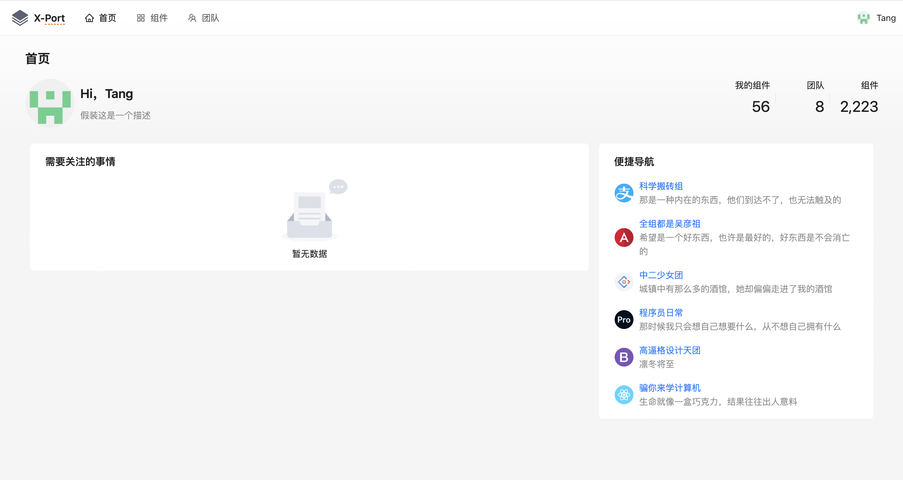

# X-Port

**刚刚开始，功能开发中...**


## 简介

X-Port 是一个开箱即用的开源内部开发者门户，改善开发者的体验，提升工作效率。

此项目受 [Backstage](https://backstage.io) 和 [Compass](https://www.atlassian.com/software/compass) 的启发。

Backstage 很好，但是它是一个开发平台，需要进行大量的定制（Material Design 有点不习惯），而 X-Port 开箱即用。

Compass 开箱即用精心设计（好看），但其是一个SaaS服务，需要 Atlassian 提供的认证服务，目前免费。

## 快速开始

#### 1. 配置文件

生成配置文件，参考 [server.yml](conf/server.yaml)

#### 2. Docker 运行

```shell
docker pull ghcr.io/tang95/x-port:main

docker run --rm \
  -p 8080:8080 \
  -v server.yaml:/app/config.yaml \
  ghcr.io/tang95/x-port:main
```

#### 3. 访问

打开 http://localhost:8080

## 功能介绍

还没开始，先看看菜单...



## 贡献

#### 1. Git 克隆

```shell
git clone git@github.com:tang95/x-port.git

cd x-port
```

#### 2. 前端

注意后端请求转发配置[.umirc.ts](console/.umirc.ts)，详细配置参考 [Umi.js](https://umijs.org)

```shell
cd console
yarn
yarn start
```

访问 http://localhost:8000

#### 3. 后端

前提条件

1. 需要 Go 环境，推荐 go 1.22+
2. 生成自己的配置文件，参考 [server.yaml](conf/server.yaml)

```shell
cd x-port
go mod download
# 默认读取 $HOME/.x-port/server.yaml，建议放在此处。
go run ./cmd server -c server.yaml
```
